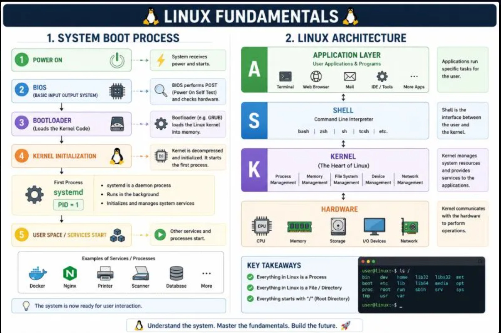

# Day 02 - Linux Architecture, Processes, and systemd

- the core componets of Linux (kernel, user space, init/systemd)
    - **kernel**: This is core component of OS.It acts as a bridge between software applications and physical hardware, managing memory, CPU time, and device communication.
    - **user space**: user space is the memory area where application software, daemons, and some drivers execute, typically with one address space per process.
    -  **init/systemd**: it the process with PID 1, the first process started during a computer system's boot-up.

- How Processes are created and managed
    - when the application is launch or execute a command, system create a process for it. keneral is in charge of managing these process, These processes have a unique PID.

**CMD**: ps -ef or top or jobs

- what systemd does and why it matters. 
    - It acts as the very first process that boots when your system turns on (Process ID 1), and its primary job is to initialize the system, start background services (daemons), and manage processes throughout your session.

- Explain **process states**

    - **running (R)**: indicates that a process is currently active and processing instructions. or is in a "run queue," waiting for its turn to be scheduled.
    - **Sleeping (S)**: The process is waiting for an event to complete, such as user input or a network signal. It can be woken up early by a signal.
    - **Uninterruptible Sleep (D)**: This is a specialized waiting state, usually used when a process is waiting for direct hardware I/O (like a disk read). Unlike standard sleep, it cannot be interrupted by signals until the I/O operation completes.
    - **zombie(Z)**: A process that has finished execution but still has an entry in the system's process table.

- List Commands used in daily
    - ps -ef : to check the process
    - top : to check CPU, memory and current process
    - cd : change directory to home folder of user 
    - ls -l : list folder and file in current directory
    - head <filename.extension> -n 1
    - cd / : root directory
    - uname -srm or cat /etc/os-release or lsb_release -d : to check  Linux kernel architecture, name, version, and release.
    - PWD : folder structure current DIR

