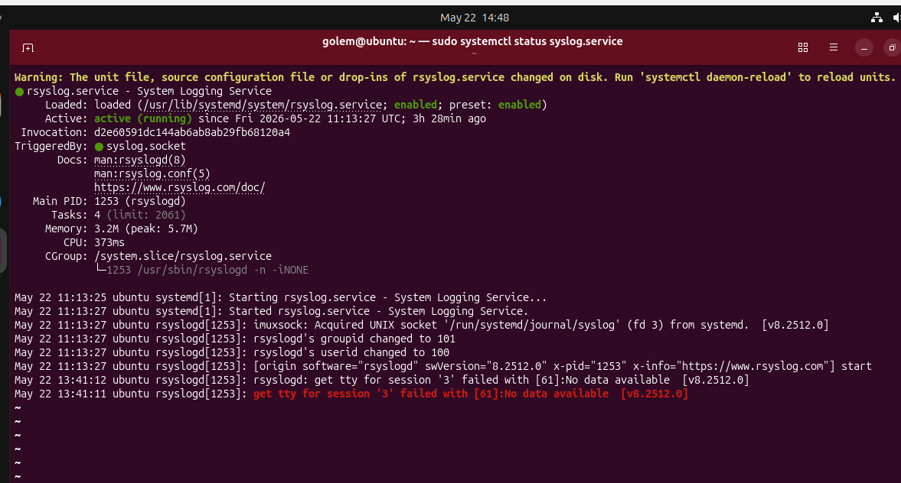

# Day 04 – Linux Practice: Processes and Services

## Task
Today’s goal is to **practice Linux fundamentals with real commands**.

- Process checks
Used **top** cmd and could see root process and how may user login, running process, cpu, memory

pgrep -l corn , ps <ID>

tocheck the locked process:
sudo lslocks

- Inspect one systemd service

checked one service name syslog.service using cmd "sudo systemclt status syslog.service".

>could see the details ofservice (like loaded, status, tigger etc and few line of logs.)

systemctl list-units --type=service (--state=running), See only specific units, such as services, sockets, or timers.

- Capture a small troubleshooting flow

used : pgrep -l cron, ps <id> 

- Log checks
folder : /var/log
tail -n 10 syslog

grep -i error /var/log/messages

command is used to query the content of the systemd journal.
journalctl
journalctl -u nginx
journalctl --since "2024-06-19"

**systemd**
Action| Command  | Description

Check Status |systemctl status <service>| Shows if a service is active, running, or failed, plus recent log entries.
Start | sudo systemctl start <service>| Starts a service immediately for the current session.
Stop | sudo systemctl stop <service> | Stops a running service immediately.
Restart | sudo systemctl restart <service> | Shuts down and immediately starts the service again.
Reload |sudo systemctl reload <service>| Tells a service to re-read its configuration files without stopping the process.
Enable | sudo systemctl enable <service> | Configures a service to start automatically whenever the system boots.
Disable | sudo systemctl disable <service>| Prevents a service from starting automatically at boot.

This is hands-on. Keep it simple and focused on fundamentals.

