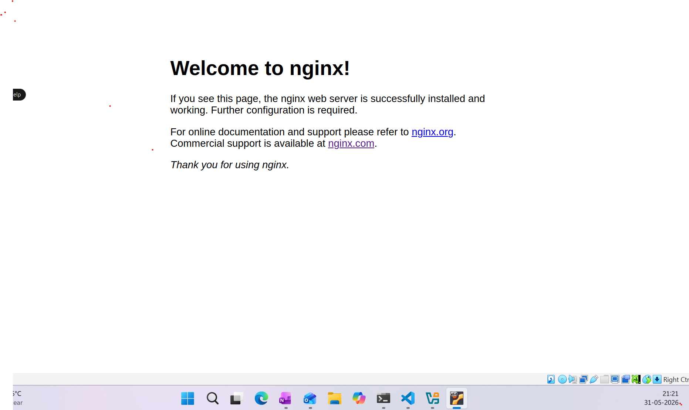

# Day 08 - Cloud Server Setup: Docker, Nginx & Web Deployment

## Part1: Lauch clound Instance & SSH Access

**Step 1: Create a Cloud Instance**

- **Commands Used:**
As Creating instance was perfromed in AWS Platform
    - Network -> create security group -> allow SSH traffic (Port 22)

- **Challenges Faced:**
None, as followed imp note like, enable SSH traffic at securtiy group

- **What I Learned:**
Different type of OS, filesystem(EFS), key pair creation, enabling SSH traffic, cofigure storage


**Step 2: Connect Via SSH**

- **Commands Used:**
    - ssh-keygen  (in server where we have to connect)
    - rw premisson appiled for user : chmod 400 devops-key
    - ssh -i "key.pem" username@DNS

- **Challenges Faced:**
forgot to update public key in Authorized_key file.


- **What I Learned:**
    - private key should have rw- permission for user.
    - private key of Destination server will be in source server.
    - public key in Authorized_key of Destination server.

### Part 2: Install Docker & Nginx

**Step 1: Update System & install Nginx**

- **Commands Used:**
    
    **Update system and install ngnix**
    - sudo apt update 
    - sudo apt install nginx docker.io
    
    **Status check for Nginx service**
    - systemctl status nginx
    - systemctl is-enabled nginx

    ```bash

    **o/p:** 
    ubuntu@training:~$ systemctl status nginx
    nginx.service - A high performance web server and a reverse proxy server
     Loaded: loaded (/usr/lib/systemd/system/nginx.service; enabled; preset: enabled)
     Active: active (running) since Sun 2026-05-31 14:36:27 UTC; 1h 7min ago
    Invocation: 9090a4e01a36421c8cbd3b91efecdb6a
       Docs: man:nginx(8)
    Process: 1538 ExecStartPre=/usr/sbin/nginx -t -q -g daemon on; master_process on; (code>
    Process: 1566 ExecStart=/usr/sbin/nginx -g daemon on; master_process on; (code=exited, >
    Main PID: 1590 (nginx)
      Tasks: 3 (limit: 1592)
     Memory: 4.6M (peak: 5M)
        CPU: 68ms
     CGroup: /system.slice/nginx.service
             ├─1590 "nginx: master process /usr/sbin/nginx -g daemon on; master_process on;"
             ├─1591 "nginx: worker process"
             └─1592 "nginx: worker process"

    May 31 14:36:27 training.devops.com systemd[1]: Starting nginx.service - A high performance
    ```

- **Challenges Faced:**
    enable the port 80 in securitly

- **What I Learned:**
    - update the system before install any package.
    - also check the service is-enabled 

### Part 3: Security Group Configuration (10 minutes)

**Test Web Access:**
Open browser and visit: `http://<your-instance-ip>`



### Part 4: Extract Nginx Logs

**Step 1: View Nginx Logs**

- **Commands Used:**
    - journal -u nginx -f
    

**Step 2: Save Logs to File**

- **Commands Used:**
    - journal -u nginx >> nginx-logs.txt
    

**Step 3: Download Log File to Your Local Machine**

 **For AWS:**
    - scp -i your-key.pem ubuntu@instance-ip:~/nginx-logs.txt.


